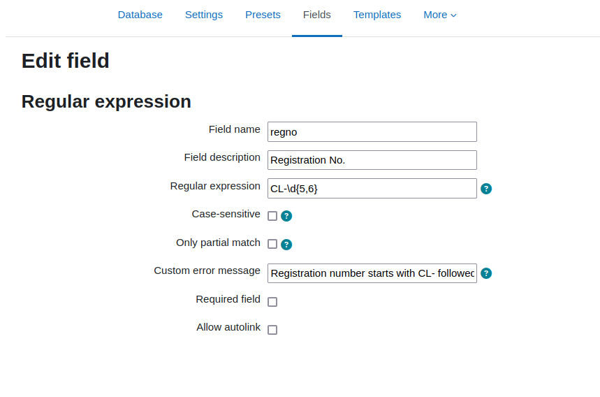
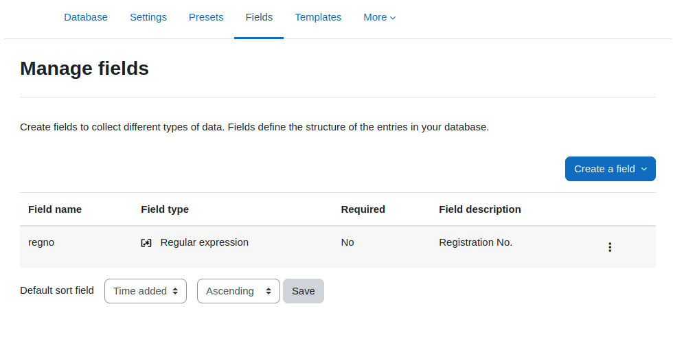
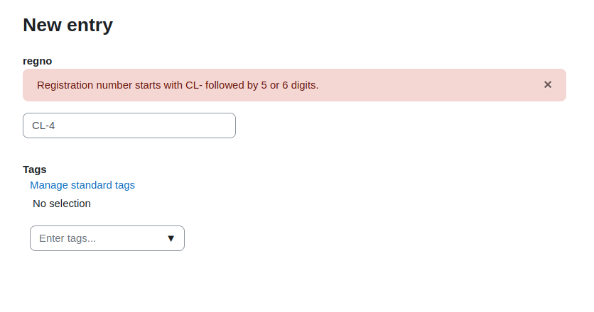

# Database Field Regular expression

This plugin provides an additional field type for regular expression for the
database activity. The field is very similar to the "Short text" field.
The main difference is that input can be validated against a regular
expression that must match before the value is accepted.

## Installation

Please run the following steps:
1. Extract the zip archive into 
`<moodle_install_dir>/mod/data/field/`. 
1. Rename the newly created directory `moodle-datafield_regex` into `regex`
so that the files from the repository are inside the directory hierarchy
`<moodle_install_dir>/mod/data/field/regex`.
1. Run `php mod/data/field/regex/cli/install.php` to symlink/copy
the icon file from the plugin directory into the `mod/data/pix/field`
directory. This step is optional, when not executed, the icon next to the
regex entry under the button "Create a field" and in the list of existing
fields will be missing.
1. Finish the installation via the Moodle admin page.

## Usage

Within your database activity in the *Fields* tab when creating a new
field, the selection contains the type "Regex".

### Creating a new field

When creating a new field of the type regular expression this dialogue
shows up:

Apart from the standard settings for a field, there are:
* Regular expression: for the regular expression itself. The term
must not contain delimiter characters, such as `/`. Also, these characters
don't need to be escaped in the string.
* Case-sensitive: check for case in the regex term. This need to be checked
when the patter mixes upper case and lower case letters or, you want to explicit
have a certain format, without transformation of the values in post processing.
* Only partial match: By default the regular expression is applied to the entire
string (from the beginning to the end - using the anchor characters `^` and
`$`). To enable a partial match, this option can be set. The regex pattern
then must only match somewhere in the submitted value.
* Custom error message: By default a generic error message is displayed
to the user when the input is not valid, i.e. does not match the regular
expression. This error message can be customized, so that the user get's
an idea how a correct input should look like. The error message is passed
to the Moodle filters before being displayed. Therefore, multi language
error messages can be provided.

The other options *Required field* and *Allow autolink* are standard
Moodle options that do not change in this context.

Whe the field settings are saved the newly created field shows up
in the list of fields.

### Add a new entry

The appearance of a field of the type regular expression looks the same
as a short text field. The difference is, that the input is validated
against the provided regular expression. If the input does not match
an error message is shown to the user and the entry cannot be saved.

With a customized error message the user can be given a hint how
the input is supposed to look like. Otherwise, a generic error message
is shown that the input is invalid.

With template customization you may also provide further explanations
to the user which input is expected.

## Attribution

The SVG icon representing the regular expression datatype plugin was
taken from https://iconduck.com/icons/275980/regex. It's published
under the [CC BY 4.0](https://iconduck.com/licenses/cc-by-4.0) license.

## Version History

### 1.1

- Add possibility to add a custom error message when input is invalid.
- Documentation in README file extended with screenshots

### 1.0

Initial release.